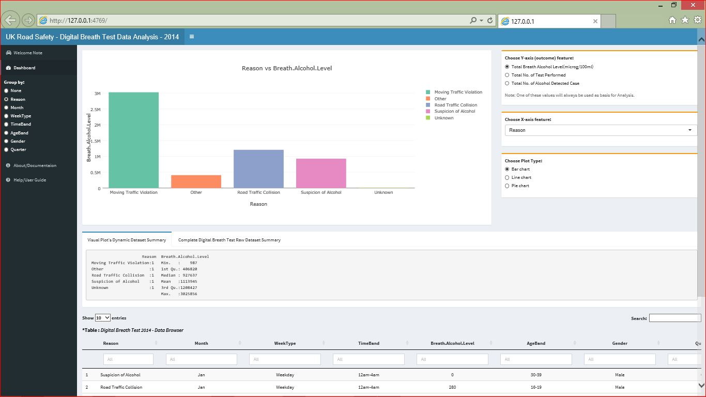

---
title       : Digital Breath Test Data Analysis 
subtitle    : Shiny App
author      : Wong Wing Keng
date        : January, 2016

framework   : revealjs  # {io2012, html5slides, shower, dzslides, ...}
revealjs:
  theme: black
highlighter : highlight.js  # {highlight.js, prettify, highlight}
hitheme     : zenburn  # 
widgets     : [bootstrap, quiz]  # {mathjax, quiz, bootstrap}
mode        : selfcontained # {standalone, draft}
knit        : slidify::knit2slides

---  

## Digital Breath Test Data Analysis Tool
### The Shiny App 

<br>
<br>
<br>
<br>
WONG WING KENG    
Jan, 2016  

---  

### The Digital Breath Test Analysis App

* Enable quick review to UK GOV Road Safety Data.   
* Helps understand trends and extract valuable information.     
* Helps decision making, policies planning, raises safety awareness etc...   
* Use anywhere, anytime; online on any devices (computer,tablet, mobile devices...)  
  
<br>
<small><span style="color:rgb(255, 140, 0)">Data source</span>  
Digital Breath Test Data - England and Wales 2014.  
Source: [DATA.GOV.UK, Road Safety Data] (https://data.gov.uk/dataset/road-accidents-safety-data)  
*Suitable for those with interest on Road Safety Data Trending for England.</small> 

---  

### Featuring

<strong><span style="color:rgb(255, 255, 0)">DYNAMIC DATA BROWSER</span></strong>
* Quick data searching 
* Individual data column filtering
* View complete data details from the dataset  
<br>

```{r dtable,results="asis", echo=FALSE, cache=F, fig.width=15, fig.height=2}

## More efficient Use of external R script 
## to generate R DT Table

source('DTable.R')

```

---  

### Featuring

<strong><span style="color:rgb(255, 255, 0)">INTERACTIVE CHARTS</span></strong>  
* Zoom in/out of area of interest in Charts  
* Dynamic filtering on Chart legend items  
* Download Chart for offline usage   
* Different Chart options: Bar, Line and Pie Chart   

```{r chart_type,results="asis", echo=FALSE, cache=F, fig.width=15, fig.height=4}

## More efficient Use of external R script 
## to generate ggplots charts

source('Charts.R')

```


---   


## Contact & Support

Try out the complete App now at  
 [wk5953919.shinyapps.io](https://wk5953919.shinyapps.io/DigitalBreathTest/)
<div style='text-align: center;'>
    <a href="https://wk5953919.shinyapps.io/DigitalBreathTest/">
        
    </a>        
</div>

<small> For any support issue or enquiry, contact me at  
<2wk@mail.com>  
Visit [Git Hub Repo] (https://github.com/WongWingKeng/Data-Products)
</small>


